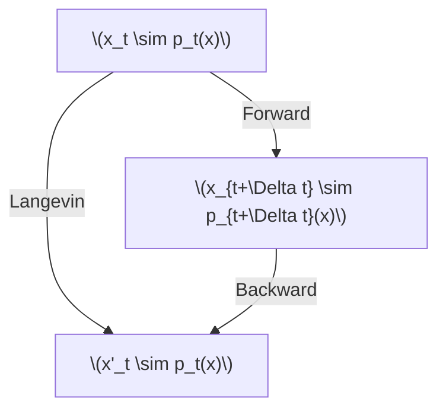
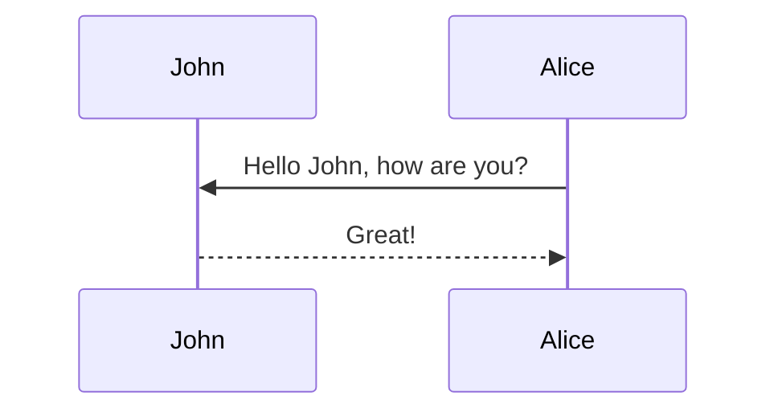

The denoising diffusion probabilistic model (DDPM) is the most fundamental type of diffusion model, consisting of two primary processes: the forward and backward diffusion processes. Most explanations of these processes fall into three main frameworks: the Variational Autoencoder (VAE) perspective, the score-based perspective, and the flow-based perspective.

The VAE perspective interprets the forward and backward diffusion processes as an encoder and decoder, respectively, applying Markov chain modeling, Bayes’ theorem, and using the Evidence Lower Bound (ELBO) as the training objective. While this approach is intuitive for much of the machine learning community, it involves lengthy mathematical derivations and often blurs a crucial distinction: in VAEs, both the prior and posterior are approximations, whereas in diffusion models, the prior and posterior are duals—they are exact in theory.

The score-based perspective emphasizes the mathematical duality between the forward and backward processes. It usually introduces the forward process first and treats the backward process as an oracle, often citing Anderson (1982). However, grasping the full SDE or ODE formulation of the backward process requires familiarity with advanced concepts like the Kolmogorov equations and the continuity equation, making this approach less accessible. The strong focus on denoising score matching can also obscure its connection to maximum likelihood, further limiting its intuitive appeal.

A third valuable perspective is the flow-based viewpoint, which has become increasingly popular in modern diffusion models. This approach is theoretically equivalent to both the VAE and score-based frameworks, but it distinguishes itself by emphasizing an intuitive and visually accessible straight-line interpolation between data and noise. While this simplicity makes the flow-based perspective appealing and approachable, it also carries the risk of oversimplification. Interpreting the forward and backward diffusion paths as mere straight-line interpolations may overlook the intricately paired relationship required for these processes to form an exact dual pair—an essential aspect underpinning the theoretical foundation of diffusion models.

In this article, we offer a perspective that is both accessible and nuanced: the Langevin viewpoint. This approach maintains a focus on the dual nature of the forward and backward processes, while relying only on fundamental techinques of stochastic differential equations (SDEs). The central insight is encapsulated in the following triangle relationship:

<div class="row mt-3">
    <div class="col-md-12 col-lg-10 offset-lg-1 mt-3 mt-md-0">
        
    </div>
</div>



which illustrates the connection among the forward, backward diffusion process and the Langevin dynamics.

# Langevin Dynamics

**Langevin Dynamics** is a special diffusion process that aims to generate samples from a probability distribution $$p(\mathbf{x})$$. It is defined as:

$$
d\mathbf{x}_t = \mathbf{s}(\mathbf{x}_t) dt + \sqrt{2} d\mathbf{W}_t, \label{langevin dynamics}
$$

where $$\mathbf{s}(\mathbf{x}) = \nabla_{\mathbf{x}} \log p(\mathbf{x})$$ is the score function of $$p(\mathbf{x})$$. This dynamics is often used as a Monte Carlo sampler to draw samples from $$p(\mathbf{x})$$, since $$p(\mathbf{x})$$ is its stationary distribution—the distribution that $$\mathbf{x}_t$$ converges to and and remains at as $$t \to \infty$$, regardless of the initial distribution of $$\mathbf{x}_0$$. 


<details markdown="1">
<summary><em>If you're comfortable simply assuming that $p(\mathbf{x})$ is the stationary distribution of the Langevin dynamics, you can skip this section. Otherwise, here is a short argument:</em> (click to expand)</summary>

1. Write the dynamics in “energy” form as $$d\mathbf{x}_t = -\nabla E(\mathbf{x})\,dt + \sqrt{2}\,d\mathbf{W}_t$$. The randomness $d\mathbf{W}_t$ perturbs the system to equilibrium, where states with the same energy $E(\mathbf{x})$ have equal probability. Thus, the stationary distribution is $p(\mathbf{x}) = f(E(\mathbf{x}))$ for some function $f$.

2. Consider $N$ independent copies $\mathbf{x}_1, \dots, \mathbf{x}_N$. Their joint density is the product $p(\mathbf{x}_1) \cdots p(\mathbf{x}_N)$. Treating them as a single system, the total energy is additive: $E(\mathbf{x}_1, \dots, \mathbf{x}_N) = \sum E(\mathbf{x}_i)$. So the joint stationary density must also be $g(\sum E(\mathbf{x}_i))$ for some function $g$. The only function satisfying both the product (independence) and sum (additivity) forms for all $N$ is the exponential: $f(E) = e^{-\beta E}$, yielding $p(\mathbf{x}) \propto e^{-\beta E(\mathbf{x})}$.

3. To find $\beta$, take $E(\mathbf{x}) = \frac{1}{2} \|\mathbf{x}\|^2$, giving the Ornstein–Uhlenbeck process $d\mathbf{x}_t = -\mathbf{x}\,dt + \sqrt{2}\,d\mathbf{W}_t$ with known stationary $\mathcal{N}(0, I)$, density $\propto e^{-\frac{1}{2} \|\mathbf{x}\|^2}$. Matching forms gives $\beta = 1$.

Thus, the dynamics $$d\mathbf{x}_t = -\nabla E(\mathbf{x})\,dt + \sqrt{2}\,d\mathbf{W}_t$$ has stationary distribution $$\propto e^{-E(\mathbf{x})}$$, and $$d\mathbf{x}_t = \nabla_{\mathbf{x}} \log p(\mathbf{x}) \, dt + \sqrt{2} \, d\mathbf{W}_t$$ has stationary distribution $p(\mathbf{x})$. 


</details>

### Langevin Dynamics as 'Identity'

The stationary of $$p(\mathbf{x})$$ is very important: The Langevin dynamics for $$p(\mathbf{x})$$ acts as an "identity" operation on this distribution, transforming samples from $$p(\mathbf{x})$$ into new samples from the same distribution.

<div class="row mt-3">
    <div class="col-md-10 offset-md-1 col-lg-8 offset-lg-2 mt-3 mt-md-0">
        
    </div>
</div>


# Spliting the Identity: Forward and Backward Processes in DDPM
The Denoising Diffusion Probabilistic Models (DDPMs) [^Ho2020DenoisingDP] are models that generate high-quality images from noise via a sequence of denoising steps. Denoting images as random variable $$\mathbf{x}$$ of the probabilistic density distribution $$p(\mathbf{x})$$, the DDPM aims to learn a model distribution that mimics the image distribution $$p(\mathbf{x})$$ and draw samples from it. The training and sampling of the DDPM utilize two diffusion process: the forward and the backward diffusion process. 


## The Forward Diffusion Process

The forward diffusion process in DDPM generates the necessary training data: clean images and their progressively noised counterparts. It gradually adds noise to existing images $$\mathbf{x}_0 \sim p(x)$$ using the Ornstein-Uhlenbeck diffusion process (OU process) [^Uhlenbeck1930OnTT] within a finite time interval $$t\in [0,T]$$. The OU process is defined by the stochastic differential equation (SDE):

$$
d \mathbf{x}_t = - \frac{1}{2} \mathbf{x}_t dt + d\mathbf{W}_t, \label{Forward Process}
$$

in which $$t$$ is the forward time of the diffusion process, $$\mathbf{x}_t$$ is the noise contaminated image at time $$t$$, and $$\mathbf{W}_t$$ is a Brownian noise.

Note that $$-\mathbf{x}$$ is just the score function of the standard Gaussian distribution $$\mathcal{N}(\mathbf{0},I)$$. Thus, the forward diffusion process corresponds to the Langevin dynamics of the standard Gaussian $$\mathcal{N}(\mathbf{0},I)$$.

The forward diffusion process has $$\mathcal{N}(\mathbf{0},I)$$ as its stationary distribution. This means, for any initial distribution $$p_0(\mathbf{x})$$ of positions $$\{\mathbf{x}_0^{(1)},...,\mathbf{x}_0^{(N)}\}$$, their density $$p_t(\mathbf{x})$$ converges to $$\mathcal{N}(\mathbf{0},I)$$ as $$t\to\infty$$. When these positions represent vectors of clean images, the process describes a gradual noising operation that transforms clean images into Gaussian noise.

One forward diffusion step with a step size of $$\Delta t$$ is displayed in the following picture.


## The Backward Diffusion Process

The backward diffusion process is the conjugate of the forward process. While the forward process evolves $$p_t(\mathbf{x})$$ toward $$\mathcal{N}(\mathbf{0},I)$$, the backward process reverses this evolution, restoring $$\mathcal{N}(\mathbf{0},I)$$ to $$p_t$$.

To derive it, we employ Langevin dynamics as a stepping stone, which provides a starightforward way to obtain the backward diffusion process: 


$$\ref{Langevin Dynamics}$$ functions as an "identity" operation with respect to a distribution. Given that the backward process is the reverse of the forward process, the composition of the forward and backward process at time $$t$$ must therefore reproduce the Langevin dynamics for $$p_t(\mathbf{x})$$, as shown in the following picture




To formalize this, consider the Langevin dynamics for $$ p_t(\mathbf{x}) $$ with a distinct time variable $$ \tau $$, distinguished from the forward diffusion time $$ t $$. This dynamics can be decomposed into forward and backward components as follows:  

$$
\begin{split}  
d\mathbf{x}_\tau &= \mathbf{s}(\mathbf{x}_\tau, t) d\tau + \sqrt{2}\, d\mathbf{W}_\tau, \\
&= \underbrace{-\frac{1}{2} \mathbf{x}_\tau d\tau + d\mathbf{W}_\tau^{(1)}}_{\text{Forward}} + \underbrace{ \left( \frac{1}{2} \mathbf{x}_\tau + \mathbf{s}(\mathbf{x}_\tau, t) \right)d\tau + d\mathbf{W}_\tau^{(2)}}_{\text{Backward} },  
\end{split}  
$$

where $$ \mathbf{s}(\mathbf{x}, t) = \nabla_{\mathbf{x}} \log p_t(\mathbf{x}) $$ is the score function of $$ p_t(\mathbf{x}) $$. We have utilized the property that $$\sqrt{2}\, d\mathbf{W}_\tau = \sqrt{2 dt} \boldsymbol{\epsilon} = \sqrt{dt} \boldsymbol{\epsilon}_1 + \sqrt{dt} \boldsymbol{\epsilon}_2 = d\mathbf{W}_\tau^{(1)} + d\mathbf{W}_\tau^{(2)}$$. 

The "Forward" part in this decomposition corresponds to the forward diffusion process, effectively **increasing the forward diffusion time $$ t $$ by $$ d\tau $$**, bringing the distribution to $$p_{t + d\tau}(\mathbf{x})$$. Since the forward and backward components combine to form an "identity" operation, the "Backward" part must reverse the forward process—**decreasing the forward diffusion time $$ t $$ by $$ d\tau $$** and restoring the distribution back to $$ p_t(\mathbf{x}) $$.


Now we can define the backward process according to the backward part in the equation above, and a backward diffusion time $$t'$$ different from the forward diffusion time $$t$$:

$$
d\mathbf{x}_{t'} = \left( \frac{1}{2} \mathbf{x}_{t'}+ \mathbf{s}(\mathbf{x}_{t'}, t) \right) dt' + d\mathbf{W}_{t'}.
$$

One step of this backward diffusion process with $$dt' = \Delta t$$ acts as a reversal of the forward process.




The backward diffusion process itself is also a standalone SDE that advances the backward diffusion time $$t'$$. If $$\mathbf{x}_{t'} \sim q_{t'}(\mathbf{x})$$, then one step of the backward diffusion process with $$dt' = \Delta t'$$ brings it to $$\mathbf{x}_{t' + \Delta t'} \sim q_{t' + \Delta t'}(\mathbf{x})$$.



These two interpretations help us determine the relationship between the forward diffusion time $$t$$ and the backward diffusion time $$t'$$. Since $$dt'$$ is interpreted as a "decrease" in the forward diffusion time $$t$$, as well as a "increase" of the backward diffusion time $$t'$$, we have 

$$
dt = -dt'
$$

which means the backward diffusion time is the inverse of the forward. To make $$t'$$ lies in the same range $$[0, T]$$ of the forward diffusion time, we define $$t = T - t'$$. In this notation, the backward diffusion process [^Anderson1982ReversetimeDE] is

$$
d\mathbf{x}_{t'} = \left( \frac{1}{2} \mathbf{x}_{t'}+ \mathbf{s}(\mathbf{x}_{t'}, T-t') \right) dt' + d\mathbf{W}_{t'}, \label{Backward Process}
$$

in which $$t' \in [0,T]$$ is the backward time, $$\mathbf{s}(\mathbf{x}, t) = \nabla_{\mathbf{x}} \log p_t(\mathbf{x})$$ is the score function of the density of $$\mathbf{x}_{t}$$ in the forward process.

### Forward-Backward Duality

We have previously shown that a backward step is the reverse of a forward step: advancing time $$t'$$ in the backward process corresponds to receding time $$t$$ by the same amount in the forward process. What then occurs when we chain together a series of forward and backward steps? Consider the following process: start with $$\mathbf{x}_0$$, evolve it via the $$\ref{Forward Process}$$ to $$\mathbf{x}_T$$, then take $$\mathbf{x}_T$$ as the initial position $$\mathbf{x}_{0'}$$ of the $$\ref{Backward Process}$$ and evolve it to $$\mathbf{x}_{T'}$$. This sequence is illustrated in the figure below.



The green arrows represent consecutive forward process steps that advance the forward diffusion time $$t$$, while the blue arrows indicate consecutive backward process steps that advance the backward diffusion time $$t'$$. 

We examine the relationship between $$\mathbf{x}_{t}$$ in the forward diffusion process and $$\mathbf{x}_{t'=T-t}$$ in the backward diffusion process. The composition of a forward and a backward step constitutes a Langevin dynamics step. This allows us to connect $$\mathbf{x}$$ in the forward process with those in the backward process through Langevin dynamics steps, as illustrated below:



**Each horizontal row in this picture corresponds to consecutive steps of Langevin dynamics, which alters the samples while maintaining the same probability density**. This illustrates the duality between the forward and backward diffusion processes: while $$\mathbf{x}_t$$ (forward) and $$\mathbf{x}_{(T-t)'}$$ (backward) are distinct samples, they obey the same probability distribution.


- It's important to note that the backward diffusion process does not generate identical samples to the forward process; rather, it produces samples according to the same probability distribution, due to the identity property of Langevin dynamics.


To formalize the duality, we define the densities of $$\mathbf{x}_t$$ (forward) as $$p_t(\mathbf{x})$$, the densities of $$\mathbf{x}_{t'}$$ (backward) as $$q_{t'}(\mathbf{x})$$. If we initialize

$$
q_0(\mathbf{x}) = p_T(\mathbf{x}),  
$$

then their evolution are related by  

$$
q_{t'}(\mathbf{x}) = p_{T-t'}(\mathbf{x}) 
$$

For large $$T$$, $$p_T(\mathbf{x})$$ converges to $$\mathcal{N}(\mathbf{x}|\mathbf{0},I)$$. Thus, the backward process starts at $$t'=0$$ with $$\mathcal{N}(\mathbf{0},I)$$ and, after evolving to $$t'=T$$, generates samples from the data distribution:

$$
q_T(\mathbf{x}) = p_0(\mathbf{x}) \quad \text{(data distribution)}.  
$$

This establishes an exact correspondence between the forward diffusion process and the backward diffusion process, indicating that the backward diffusion process can generate image data from pure Gaussian noise.


Note: please use the table of contents as defined in the front matter rather than the traditional markdown styling.

## Equations

This theme supports rendering beautiful math in inline and display modes using [MathJax 3](https://www.mathjax.org/) engine.
You just need to surround your math expression with `$$`, like `$$ E = mc^2 $$`.
If you leave it inside a paragraph, it will produce an inline expression, just like $$ E = mc^2 $$.

To use display mode, again surround your expression with `$$` and place it as a separate paragraph.
Here is an example:

$$
\left( \sum_{k=1}^n a_k b_k \right)^2 \leq \left( \sum_{k=1}^n a_k^2 \right) \left( \sum_{k=1}^n b_k^2 \right)
$$

Note that MathJax 3 is [a major re-write of MathJax](https://docs.mathjax.org/en/latest/upgrading/whats-new-3.0.html)
that brought a significant improvement to the loading and rendering speed, which is now
[on par with KaTeX](http://www.intmath.com/cg5/katex-mathjax-comparison.php).

## Images and Figures

Its generally a better idea to avoid linking to images hosted elsewhere - links can break and you
might face losing important information in your blog post.
To include images in your submission in this way, you must do something like the following:

```markdown

```

which results in the following image:



To ensure that there are no namespace conflicts, you must save your asset to your unique directory
`/assets/img/2025-04-27-[SUBMISSION NAME]` within your submission.

Please avoid using the direct markdown method of embedding images; they may not be properly resized.
Some more complex ways to load images (note the different styles of the shapes/shadows):

<div class="row mt-3">
    <div class="col-sm mt-3 mt-md-0">
        
    </div>
    <div class="col-sm mt-3 mt-md-0">
        
    </div>
</div>
<div class="caption">
    A simple, elegant caption looks good between image rows, after each row, or doesn't have to be there at all.
</div>

<div class="row mt-3">
    <div class="col-sm mt-3 mt-md-0">
        
    </div>
    <div class="col-sm mt-3 mt-md-0">
        
    </div>
</div>

<div class="row mt-3">
    <div class="col-sm mt-3 mt-md-0">
        
    </div>
    <div class="col-sm mt-3 mt-md-0">
        
    </div>
    <div class="col-sm mt-3 mt-md-0">
        
    </div>
</div>

### Interactive Figures

Here's how you could embed interactive figures that have been exported as HTML files.
Note that we will be using plotly for this demo, but anything built off of HTML should work
(**no extra javascript is allowed!**).
All that's required is for you to export your figure into HTML format, and make sure that the file
exists in the `assets/html/[SUBMISSION NAME]/` directory in this repository's root directory.
To embed it into any page, simply insert the following code anywhere into your page.

```markdown

```

For example, the following code can be used to generate the figure underneath it.

```python
import pandas as pd
import plotly.express as px

df = pd.read_csv('https://raw.githubusercontent.com/plotly/datasets/master/earthquakes-23k.csv')

fig = px.density_mapbox(
    df, lat='Latitude', lon='Longitude', z='Magnitude', radius=10,
    center=dict(lat=0, lon=180), zoom=0, mapbox_style="stamen-terrain")
fig.show()

fig.write_html('./assets/html/2026-04-27-distill-example/plotly_demo_1.html')
```

And then include it with the following:

```html

<div class="l-page">
  <iframe
    src="{{ 'assets/html/2026-04-27-distill-example/plotly_demo_1.html' | relative_url }}"
    frameborder="0"
    scrolling="no"
    height="600px"
    width="100%"
  ></iframe>
</div>

```

Voila!

<div class="l-page">
  <iframe src="{{ 'assets/html/2026-04-27-distill-example/plotly_demo_1.html' | relative_url }}" frameborder='0' scrolling='no' height="600px" width="100%"></iframe>
</div>

## Citations

Citations are then used in the article body with the `<d-cite>` tag.
The key attribute is a reference to the id provided in the bibliography.
The key attribute can take multiple ids, separated by commas.

The citation is presented inline like this: <d-cite key="gregor2015draw"></d-cite> (a number that displays more information on hover).
If you have an appendix, a bibliography is automatically created and populated in it.

Distill chose a numerical inline citation style to improve readability of citation dense articles and because many of the benefits of longer citations are obviated by displaying more information on hover.
However, we consider it good style to mention author last names if you discuss something at length and it fits into the flow well — the authors are human and it’s nice for them to have the community associate them with their work.

---

## Footnotes

Just wrap the text you would like to show up in a footnote in a `<d-footnote>` tag.
The number of the footnote will be automatically generated.<d-footnote>This will become a hoverable footnote.</d-footnote>

---

## Code Blocks

This theme implements a built-in Jekyll feature, the use of Rouge, for syntax highlighting.
It supports more than 100 languages.
This example is in C++.
All you have to do is wrap your code in a liquid tag:


 <br/> code code code <br/> 


The keyword `linenos` triggers display of line numbers. You can try toggling it on or off yourself below:



int main(int argc, char const \*argv[])
{
string myString;

    cout << "input a string: ";
    getline(cin, myString);
    int length = myString.length();

    char charArray = new char * [length];

    charArray = myString;
    for(int i = 0; i < length; ++i){
        cout << charArray[i] << " ";
    }

    return 0;

}



---

## Diagrams

This theme supports generating various diagrams from a text description using [mermaid.js](https://mermaid-js.github.io/mermaid/){:target="\_blank"} directly.
Below, we generate examples of such diagrams using [mermaid](https://mermaid-js.github.io/mermaid/){:target="\_blank"} syntax.

**Note:** To enable mermaid diagrams, you need to add the following to your post's front matter:

```yaml
mermaid:
  enabled: true
  zoomable: true # optional, for zoomable diagrams
```

The diagram below was generated by the following code:


````

````


---

## Tweets

An example of displaying a tweet:


An example of pulling from a timeline:


For more details on using the plugin visit: [jekyll-twitter-plugin](https://github.com/rob-murray/jekyll-twitter-plugin)

---

## Blockquotes

<blockquote>
    We do not grow absolutely, chronologically. We grow sometimes in one dimension, and not in another, unevenly. We grow partially. We are relative. We are mature in one realm, childish in another.
    —Anais Nin
</blockquote>

---

## Layouts

The main text column is referred to as the body.
It is the assumed layout of any direct descendants of the `d-article` element.

<div class="fake-img l-body">
  <p>.l-body</p>
</div>

For images you want to display a little larger, try `.l-page`:

<div class="fake-img l-page">
  <p>.l-page</p>
</div>

All of these have an outset variant if you want to poke out from the body text a little bit.
For instance:

<div class="fake-img l-body-outset">
  <p>.l-body-outset</p>
</div>

<div class="fake-img l-page-outset">
  <p>.l-page-outset</p>
</div>

Occasionally you’ll want to use the full browser width.
For this, use `.l-screen`.
You can also inset the element a little from the edge of the browser by using the inset variant.

<div class="fake-img l-screen">
  <p>.l-screen</p>
</div>
<div class="fake-img l-screen-inset">
  <p>.l-screen-inset</p>
</div>

The final layout is for marginalia, asides, and footnotes.
It does not interrupt the normal flow of `.l-body`-sized text except on mobile screen sizes.

<div class="fake-img l-gutter">
  <p>.l-gutter</p>
</div>

---

## Other Typography?

Emphasis, aka italics, with _asterisks_ (`*asterisks*`) or _underscores_ (`_underscores_`).

Strong emphasis, aka bold, with **asterisks** or **underscores**.

Combined emphasis with **asterisks and _underscores_**.

Strikethrough uses two tildes. ~~Scratch this.~~

1. First ordered list item
2. Another item

- Unordered sub-list.

1. Actual numbers don't matter, just that it's a number
   1. Ordered sub-list
2. And another item.

   You can have properly indented paragraphs within list items. Notice the blank line above, and the leading spaces (at least one, but we'll use three here to also align the raw Markdown).

   To have a line break without a paragraph, you will need to use two trailing spaces.
   Note that this line is separate, but within the same paragraph.
   (This is contrary to the typical GFM line break behavior, where trailing spaces are not required.)

- Unordered lists can use asterisks

* Or minuses

- Or pluses

[I'm an inline-style link](https://www.google.com)

[I'm an inline-style link with title](https://www.google.com "Google's Homepage")

[I'm a reference-style link][Arbitrary case-insensitive reference text]

[I'm a relative reference to a repository file](../blob/master/LICENSE)

[You can use numbers for reference-style link definitions][1]

Or leave it empty and use the [link text itself].

URLs and URLs in angle brackets will automatically get turned into links.
http://www.example.com or <http://www.example.com> and sometimes
example.com (but not on Github, for example).

Some text to show that the reference links can follow later.

[arbitrary case-insensitive reference text]: https://www.mozilla.org
[1]: http://slashdot.org
[link text itself]: http://www.reddit.com

Here's our logo (hover to see the title text):

Inline-style:


Reference-style:
![alt text][logo]

[logo]: https://github.com/adam-p/markdown-here/raw/master/src/common/images/icon48.png "Logo Title Text 2"

Inline `code` has `back-ticks around` it.

```javascript
var s = "JavaScript syntax highlighting";
alert(s);
```

```python
s = "Python syntax highlighting"
print(s)
```

```
No language indicated, so no syntax highlighting.
But let's throw in a <b>tag</b>.
```

Colons can be used to align columns.

| Tables        |      Are      |  Cool |
| ------------- | :-----------: | ----: |
| col 3 is      | right-aligned | $$1600$$ |
| col 2 is      |   centered    |   $$12$$ |
| zebra stripes |   are neat    |    $$1$$ |

There must be at least 3 dashes separating each header cell.
The outer pipes (|) are optional, and you don't need to make the
raw Markdown line up prettily. You can also use inline Markdown.

| Markdown | Less      | Pretty     |
| -------- | --------- | ---------- |
| _Still_  | `renders` | **nicely** |
| 1        | 2         | 3          |

> Blockquotes are very handy in email to emulate reply text.
> This line is part of the same quote.

Quote break.

> This is a very long line that will still be quoted properly when it wraps. Oh boy let's keep writing to make sure this is long enough to actually wrap for everyone. Oh, you can _put_ **Markdown** into a blockquote.

Here's a line for us to start with.

This line is separated from the one above by two newlines, so it will be a _separate paragraph_.

This line is also a separate paragraph, but...
This line is only separated by a single newline, so it's a separate line in the _same paragraph_.
